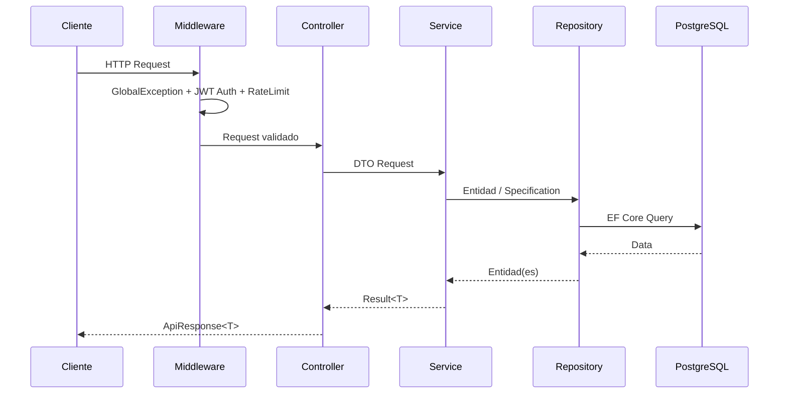
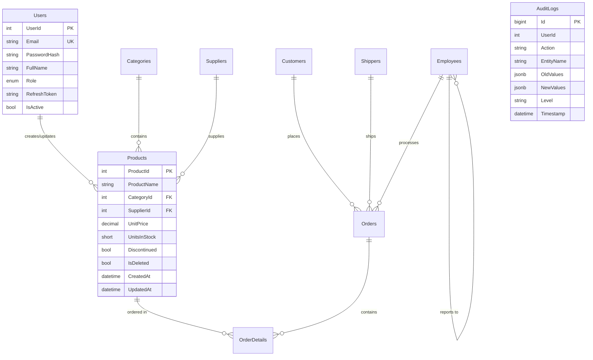
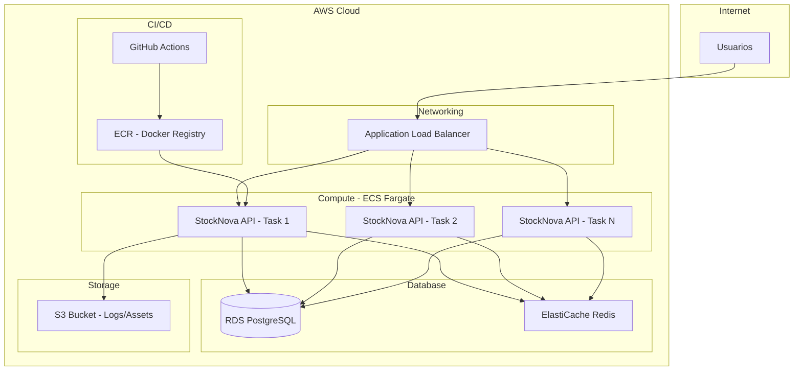

# StockNova API


API REST de gestion de inventario construida con .NET 8, Clean Architecture y PostgreSQL. Implementa autenticacion JWT, autorizacion por roles, carga masiva de productos, auditoria completa y despliegue con Docker.

> Prueba tecnica - Desarrollador Full Stack | Finanzauto S.A. BIC via ASISYA

---

## Tabla de contenido

- [Stack tecnologico](#stack-tecnologico)
- [Arquitectura](#arquitectura)
- [Patrones de diseno](#patrones-de-diseno)
- [Modelo de datos](#modelo-de-datos)
- [Endpoints](#endpoints)
- [Ejecucion local](#ejecucion-local)
- [Ejecucion con Docker](#ejecucion-con-docker)
- [Tests](#tests)
- [SonarQube](#sonarqube)
- [CI/CD](#cicd)
- [Decisiones arquitectonicas](#decisiones-arquitectonicas)
- [Escalamiento horizontal en AWS](#escalamiento-horizontal-en-aws)
- [Autor](#autor)

---

## Stack tecnologico

| Capa | Tecnologia |
|------|-----------|
| Runtime | .NET 8 LTS (C# 12) |
| Base de datos | PostgreSQL 14 |
| ORM | Entity Framework Core 8 |
| Autenticacion | JWT Bearer (access + refresh tokens) |
| Validacion | FluentValidation |
| Mapeo | AutoMapper |
| Logging | Serilog (consola + archivo) |
| Cache | IMemoryCache |
| Carga masiva | EFCore.BulkExtensions |
| Tests | xUnit + Moq + FluentAssertions + Testcontainers |
| Contenedores | Docker + Docker Compose |
| CI/CD | GitHub Actions |
| Calidad | SonarQube |

---

## Arquitectura

Clean Architecture basada en servicios con 4 capas y flujo de dependencias de afuera hacia adentro:

```
┌─────────────────────────────────────────────────┐
│                   API Layer                      │
│   Controllers, Middleware, Filters, JWT Config   │
├─────────────────────────────────────────────────┤
│              Application Layer                   │
│   Services, DTOs, Interfaces, Validators,        │
│   AutoMapper, ICacheService, IJwtTokenGenerator  │
├─────────────────────────────────────────────────┤
│             Infrastructure Layer                 │
│   EF Core, Repositories, Security, Caching,      │
│   Serilog, Database Seeders                      │
├─────────────────────────────────────────────────┤
│                Domain Layer                      │
│   Entities, Enums, Specifications, Result<T>,    │
│   Repository Interfaces                          │
└─────────────────────────────────────────────────┘
```

```
StockNova.sln
├── src/
│   ├── StockNova.Domain           (0 dependencias)
│   ├── StockNova.Application      (-> Domain)
│   ├── StockNova.Infrastructure   (-> Domain, Application)
│   └── StockNova.API              (-> Application, Infrastructure)
└── tests/
    ├── StockNova.UnitTests
    └── StockNova.IntegrationTests
```

### Flujo de una peticion



---

## Patrones de diseno

| Patron | Donde se aplica | Por que |
|--------|----------------|---------|
| **Clean Architecture** | Estructura de proyectos | Separacion de responsabilidades, testabilidad |
| **Repository** | Infrastructure (acceso a datos) | Abstraer persistencia del dominio |
| **Specification** | Filtros de consulta en Products | Encapsular logica de queries reutilizable |
| **Result\<T\>** | Retorno de servicios | Manejo explicito de exito/error sin excepciones |
| **Factory Method** | Product.Create() | Encapsular logica de creacion de entidades |
| **Options Pattern** | JwtSettings, ConnectionStrings | Configuracion tipada e inyectable |
| **CQRS Ligero** | Read/Write Repository separados | Optimizar lecturas vs escrituras sin MediatR |
| **Soft Delete** | Products (IsDeleted + global filter) | No perder datos, marcar como eliminados |
| **Audit Trail** | AuditLog table + AuditService | Trazabilidad completa de acciones |

---

## Modelo de datos



**10 tablas:** Products, Categories, Suppliers, Orders, OrderDetails, Customers, Employees, Shippers, Users, AuditLogs

---

## Endpoints

### Auth (`/api/v1/auth`)

| Metodo | Ruta | Descripcion | Auth |
|--------|------|-------------|------|
| POST | `/login` | Iniciar sesion | No |
| POST | `/register` | Registrar usuario | No |
| POST | `/refresh-token` | Renovar tokens | No |

### Products (`/api/v1/products`)

| Metodo | Ruta | Descripcion | Auth |
|--------|------|-------------|------|
| GET | `/` | Listar productos (paginado, filtros, busqueda) | No |
| GET | `/{id}` | Detalle de producto (con categoria y proveedor) | No |
| POST | `/` | Crear producto | Admin, Manager |
| PUT | `/{id}` | Actualizar producto | Admin, Manager |
| DELETE | `/{id}` | Eliminar producto (soft delete) | Admin |
| POST | `/bulk` | Carga masiva aleatoria (hasta 500K) | Admin |
| POST | `/import` | Importar productos desde CSV (IFormFile) | Admin |

**Importacion CSV:** El archivo debe tener el formato del ejemplo en `samples/products_sample.csv`. Se sube como `multipart/form-data` (boton "Choose File" en Swagger).

**Filtros disponibles en GET /products:**
- `search` - Busqueda por nombre
- `categoryId`, `supplierId` - Filtro por FK
- `minPrice`, `maxPrice` - Rango de precio
- `discontinued` - Filtro por estado
- `sortBy`, `sortOrder` - Ordenamiento
- `page`, `pageSize` - Paginacion (max 50 por pagina)

### Categories (`/api/v1/categories`)

| Metodo | Ruta | Descripcion | Auth |
|--------|------|-------------|------|
| GET | `/` | Listar categorias (cacheado 10 min) | No |
| GET | `/{id}` | Detalle de categoria | No |
| POST | `/` | Crear categoria | Admin, Manager |

### Audit Logs (`/api/v1/auditlogs`)

| Metodo | Ruta | Descripcion | Auth |
|--------|------|-------------|------|
| GET | `/` | Consultar logs (filtros: from, to, action, entityName) | Admin |

### Health (`/api/v1/health`)

| Metodo | Ruta | Descripcion | Auth |
|--------|------|-------------|------|
| GET | `/` | Estado de salud de la API | No |

---

## Ejecucion local

### Prerrequisitos

- [.NET 8 SDK](https://dotnet.microsoft.com/download/dotnet/8.0)
- [PostgreSQL 14+](https://www.postgresql.org/download/)
- [Node.js 18+](https://nodejs.org/) (para el frontend)

### 1. Clonar el repositorio

```bash
git clone https://github.com/MrDavidAlv/stocknova-api.git
cd stocknova-api
```

### 2. Configurar variables de entorno

```bash
cp .env.example .env
# Editar .env con tus valores reales
```

> **Importante:** Nunca commitear el archivo `.env`. Solo `.env.example` (con valores placeholder) esta versionado.

### 3. Crear la base de datos

```sql
-- Conectar como superusuario
sudo -u postgres psql

CREATE USER stocknova WITH PASSWORD '<TU_PASSWORD_SEGURA>';
CREATE DATABASE stocknova_db OWNER stocknova;
GRANT ALL PRIVILEGES ON DATABASE stocknova_db TO stocknova;
\q
```

> Usar la misma contraseña configurada en `POSTGRES_PASSWORD` del archivo `.env`.

### 4. Ejecutar la API

```bash
cd src/StockNova.API
dotnet run
```

La API arranca en `https://localhost:5001` y `http://localhost:5000`.
Swagger UI disponible en: `https://localhost:5001/swagger`

Las migraciones y datos semilla se ejecutan automaticamente al iniciar.

### Usuarios seed (solo desarrollo)

| Email | Rol | Descripcion |
|-------|-----|-------------|
| admin@stocknova.com | Admin | Acceso total |
| manager@stocknova.com | Manager | CRUD de productos |
| viewer@stocknova.com | Viewer | Solo lectura |

> Las credenciales de los usuarios seed se encuentran en el seeder del proyecto. En produccion, estos usuarios deben ser eliminados o sus contraseñas deben ser cambiadas inmediatamente despues del primer despliegue.

---

## Ejecucion con Docker

### Prerrequisitos

- [Docker](https://docs.docker.com/get-docker/) 20+
- [Docker Compose](https://docs.docker.com/compose/) v2+

### Configurar variables de entorno

```bash
cp .env.example .env
# Editar .env con valores seguros para cada variable
```

El archivo `.env.example` contiene todas las variables necesarias con valores placeholder. Nunca usar valores por defecto en produccion.

### Levantar todo el stack

```bash
docker compose up -d
```

Esto levanta:
- **PostgreSQL 14** en `localhost:5433` (solo desarrollo)
- **StockNova API** en `http://localhost:8080`

### Verificar que funciona

```bash
# Health check
curl http://localhost:8080/health

# Login (usar credenciales del seeder)
curl -X POST http://localhost:8080/api/v1/auth/login \
  -H "Content-Type: application/json" \
  -d '{"email":"admin@stocknova.com","password":"<PASSWORD>"}'
```

### Detener

```bash
docker compose down
```

### Detener y eliminar datos

```bash
docker compose down -v
```

---

## Tests

### Unit Tests (30 tests)

```bash
dotnet test tests/StockNova.UnitTests --verbosity normal
```

Cubren:
- **ProductService** - CRUD, bulk create, cache, validaciones
- **AuthService** - Login, register, refresh token, casos de error
- **CategoryService** - CRUD, cache, duplicados
- **Product entity** - Factory method, valores por defecto

### Integration Tests (13 tests)

```bash
dotnet test tests/StockNova.IntegrationTests --verbosity normal
```

Requieren Docker (Testcontainers levanta PostgreSQL automaticamente).

Cubren:
- **AuthController** - Registro, login, refresh token end-to-end
- **ProductsController** - CRUD completo, autorizacion por roles (401/403)

### Ejecutar todos los tests

```bash
dotnet test --verbosity normal
```

### Cobertura de codigo

```bash
dotnet test --collect:"XPlat Code Coverage"
```

---

## SonarQube

### Ejecucion local

```bash
# 1. Levantar SonarQube (si no esta corriendo)
docker run -d --name sonarqube -p 9000:9000 sonarqube:lts-community

# 2. Crear proyecto y token en http://localhost:9000

# 3. Ejecutar analisis (reemplazar <TOKEN> con el token generado)
dotnet sonarscanner begin \
  /k:"stocknova-api" \
  /d:sonar.host.url="http://localhost:9000" \
  /d:sonar.token="<TOKEN>"

dotnet build --no-incremental
dotnet sonarscanner end /d:sonar.token="<TOKEN>"
```

> El token de SonarQube es personal y no debe versionarse. Generarlo desde la interfaz web de SonarQube.

---

## CI/CD

Pipeline de GitHub Actions (`.github/workflows/ci.yml`) con 3 jobs:

```
Push to main ──> [Build & Test] ──> [Docker Push] ──> [Deploy to EC2]
                                     (ghcr.io)        (SSH + Docker Compose)
```

### Job 1: Build & Test
- Restore, compilacion en modo Release
- Unit Tests (35 tests)
- Integration Tests (13 tests) con PostgreSQL service container

### Job 2: Docker Push (solo push a main)
- Build de imagen Docker multi-stage
- Push a GitHub Container Registry (`ghcr.io`)
- Tags: `latest` + SHA del commit

### Job 3: Deploy to EC2 (solo push a main)
- Copia archivos de deploy via SCP
- Crea `.env` en servidor desde GitHub Secrets
- Pull de imagen y restart de servicios via SSH
- Health check automatico post-deploy

### Infraestructura de produccion

| Componente | Tecnologia |
|-----------|-----------|
| Servidor | AWS EC2 (Ubuntu 22.04) |
| Reverse Proxy | Nginx |
| Contenedores | Docker Compose |
| Registry | GitHub Container Registry (ghcr.io) |
| Secretos | GitHub Secrets → `.env` en servidor |

### GitHub Secrets requeridos

| Secret | Descripcion |
|--------|-------------|
| `EC2_HOST` | IP publica de la instancia EC2 |
| `EC2_SSH_KEY` | Clave privada SSH (.pem) |
| `CR_PAT` | Personal Access Token con `write:packages` |
| `POSTGRES_DB` | Nombre de la base de datos |
| `POSTGRES_USER` | Usuario de PostgreSQL |
| `POSTGRES_PASSWORD` | Contraseña de PostgreSQL |
| `JWT_SECRET_KEY` | Clave secreta JWT (min 32 caracteres) |
| `JWT_ISSUER` | Emisor del token JWT |
| `JWT_AUDIENCE` | Audiencia del token JWT |
| `CORS_ORIGINS` | Origenes permitidos (separados por coma) |

> Ningun secreto se almacena en el repositorio. El pipeline los inyecta en tiempo de deploy.

---

## Decisiones arquitectonicas

### 1. Servicios en vez de CQRS + MediatR

**Decision:** Usar `ProductService`, `CategoryService`, `AuthService`, `AuditService` directamente en lugar de Commands/Queries con MediatR.

**Razon:** CQRS es over-engineering para una aplicacion CRUD. La prueba lista CQRS como conocimiento, no como requisito de implementacion. Un desarrollador senior elige la herramienta adecuada al problema - en este caso, un service layer es mas simple, mas legible y cumple exactamente lo necesario.

### 2. Read/Write Repository separado

**Decision:** `IProductReadRepository` (solo lectura) y `IProductWriteRepository` (escritura) en vez de un solo repositorio.

**Razon:** Aplica Interface Segregation Principle (ISP). Los controladores que solo leen no necesitan acceso a metodos de escritura. Facilita la separacion de responsabilidades sin la complejidad de CQRS completo.

### 3. Specification Pattern para queries

**Decision:** Encapsular filtros complejos en `ProductFilterSpecification` en vez de metodos de repositorio con muchos parametros.

**Razon:** Los filtros de productos (busqueda, categoria, proveedor, rango de precio, ordenamiento, paginacion) son complejos. El Specification Pattern permite componer queries de forma reutilizable y testeable.

### 4. Result\<T\> en vez de excepciones

**Decision:** Los servicios retornan `Result<T>` con IsSuccess/Error en vez de lanzar excepciones para errores de negocio.

**Razon:** Las excepciones son para situaciones excepcionales, no para flujos de control esperados (usuario no encontrado, email duplicado). Result\<T\> hace el flujo explicito y es mas performante.

### 5. Soft Delete con Global Query Filter

**Decision:** Los productos no se eliminan fisicamente, se marcan con `IsDeleted=true` y EF Core los filtra automaticamente.

**Razon:** No se pierden datos historicos. Los registros eliminados pueden recuperarse. Las referencias desde OrderDetails siguen siendo validas.

### 6. JWT con Refresh Tokens

**Decision:** Access token de 60 minutos + refresh token de 7 dias, en vez de solo access token.

**Razon:** Balance entre seguridad (tokens de corta duracion) y UX (no pedir login cada hora). El refresh token permite renovar la sesion sin volver a ingresar credenciales.

### 7. Bulk Insert con EFCore.BulkExtensions

**Decision:** Usar `BulkInsertAsync` con batch size de 5000 en vez de `AddRange` + `SaveChanges`.

**Razon:** `AddRange` con 100K registros es extremadamente lento porque EF Core genera un INSERT por cada entidad. BulkExtensions usa PostgreSQL COPY protocol, reduciendo el tiempo de minutos a segundos.

---

## Escalamiento horizontal en AWS

Estrategia de despliegue en AWS Free Tier con capacidad de escalar:



### Componentes

| Componente | Servicio AWS | Proposito |
|-----------|-------------|-----------|
| API | ECS Fargate | Contenedores sin servidor, auto-scaling |
| Base de datos | RDS PostgreSQL | BD gestionada, backups automaticos, Multi-AZ |
| Cache | ElastiCache Redis | Cache distribuido (reemplaza IMemoryCache) |
| Load Balancer | ALB | Distribucion de trafico, health checks |
| Docker Registry | ECR | Almacen de imagenes Docker |
| Assets/Logs | S3 | Almacenamiento de archivos |
| CI/CD | GitHub Actions | Build, test, deploy automatizado |

### Estrategia de escalamiento

1. **Horizontal**: ECS auto-scaling basado en CPU/memoria (min 1, max N tasks)
2. **Base de datos**: RDS con read replicas para separar lecturas de escrituras
3. **Cache**: Migrar de IMemoryCache a Redis (ElastiCache) para cache compartido entre instancias
4. **Stateless**: La API ya es stateless (JWT, sin sesion en servidor), lista para multiples instancias

### Cambios necesarios para produccion AWS

- Reemplazar `IMemoryCache` por Redis (`IDistributedCache`)
- Mover connection strings y secrets a AWS Secrets Manager
- Configurar health checks en ALB apuntando a `/health`
- Configurar logs centralizados con CloudWatch
- Agregar HTTPS con ACM (Certificate Manager)

---

## Autor

**Mario David Alvarez V.**

- Email: davidalvarezzzzzzzz@gmail.com
- GitHub: [@MrDavidAlv](https://github.com/MrDavidAlv)
- Ubicacion: Bogota, Colombia

---

*Desarrollado como prueba tecnica para Finanzauto S.A. BIC via ASISYA - Posicion Desarrollador I Full Stack*
